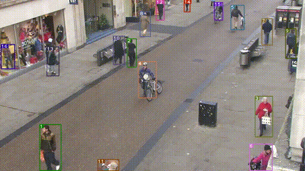

# Safe of Site - Helmet detection with Yolo V5





## Introduction - Safet of Site

This repository contains a moded version of PyTorch YOLOv5 (https://github.com/ultralytics/yolov5).


Construction site object detection project, for predicting the proper use of safety helmets with two use cases.

The first use case can be initiated by running the detect.py script in jupyter notebook (see CapStone_SOS.ipynb) or terminal.<br/>
It detects people, helmets, or if helmets are not detected, heads.<br/>
All detected people are counted and compared to the amount of helmets detected.<br/> 
If it is not equal, an error message, "Incorrect" appears on the image / frame.<br/> 
In case any heads are detected without a helmet, the same "Incorrect" message appears, indicating danger.<br/>

The second use case can be initiated by running the detectgate.py script.<br/>
It is an automated gate entrance system for construction sites.<br/> 
A person is detected in the frame and we check for their helmet. If the helmet is not detected, the gate will remain closed.<br/>
Once it is detected, we count for 30 frames, if the person had the helmet on for 30 consecutive frames, we open the gate for 15 frames.<br/> 
If the count is disrupted before it reaches 30, it resets to 0.<br/>
 


## Work in progress - People movement tracker

The detections of persons from Yolov5 are passed to a Deep Sort algorithm (https://github.com/ZQPei/deep_sort_pytorch) which tracks the persons. 
For each detection, the center of their bounding box is calculated, then the center's coordinate is passed to a dictionary each frame.
For each detection, we get all of the previous coordinate location and draw lines in consecutive order.


## Requirements

Python 3.8 or later with all requirements.txt dependencies installed, including torch>=1.7. To install run:

`pip install -U -r requirements.txt`

All dependencies are included in the associated docker images. Docker requirements are: 
- `nvidia-docker`
- Nvidia Driver Version >= 440.44

Running the app on CUDA is recommended for performance, if a GPU is available.


## Detection

Detections can be run on most image and video formats as well as live camera feed<br/>

See CapStone_SOS.ipynb to easily run the app, or use terminal with the pretrained personhelmet.pt weight at a confidence threshold of 55%<br/>

First use case:<br/>
```bash
!python detect.py --source 0 --weights personhelmet.pt --conf 0.55
```
Second use case<br/>
```bash
!python detectgate.py --source 0 --weights personhelmet.pt --conf 0.55
```

```bash
!python detect.py --source ...
```

- Video:  `--source file.mp4`
- Webcam:  `--source 0`
- Image: `--source file.jpg`

MOT compliant results can be saved to `inference/output` by 

```bash
python3 track.py --source ... --save-txt
```

## Other information

For more detailed information about the algorithms and their corresponding lisences used in this project access their official github implementations.

